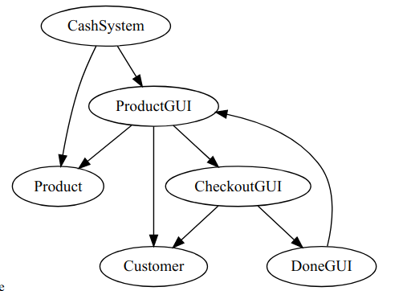

# Additional information:
Swing.
This was a group project and was a reposity on KTH github. 
I don't know how to upload a from KTH github reposity with histories to Github, so I just copied the files.
# Project in Introduction to Computer Science
### Author: Xindi Liu, Mahdi Wandi
 

#### Topic: Cash register system
 
 
 

##### Description:

A quick cash register checkout system to be used in a "quick" aisle in a supermarket/grocery store. 
The system is used by customers to register what they are buying in a cart and then checkout. 
Language developed in is Java.

 

##### Features:
- Minimum viable product:
    - Ability to enter customer mode.
    - Basic customer GUI
        - Implemented using JFrame/javax. I.e clickable buttons etc.
    - Customer can search through products.
    - Customer can add products to cart.
    - Customer can checkout.
    - New customer button after checkout.
    - Products
        - Will be implemented either through a file or towards a database(depending on what fits during production).
        - Program will have a save function that will allow the system state to be stored, regarding stock etc.
- Extra features(added as time allows):
    - Program can save returning customers.
    - Ability to enter admin mode.
    - Admin can add products.
    - Product icons.
    - Admin can remove, change or order products.
    - Customer can choose between different payment options.
    - System allows for the same product but from different brands.
 
 

##### Rough class diagram:

> Arrows indicate association.
    

