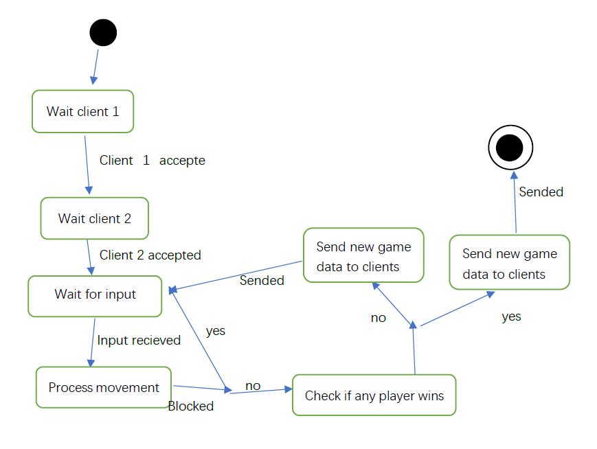
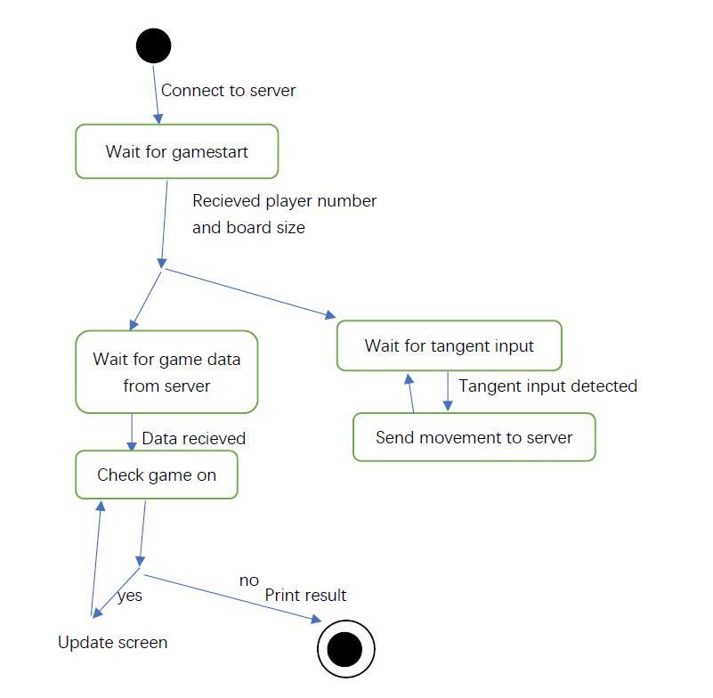

# Additional information:
Swing, Socket. 

Original README.md below:
# INET
## Spelbekrivning
Spelet är inspirerad av slither.io. Koden utgår från exemplet för tictactoe.
Spelet begränsas till två spelare. Spelarna är maskar som består av två delar: huvud och kropp. Huvud består av en ruta, kroppen är initiallt 0 ruta och kan förlängas genom att tar föremål från spelplanen. Målet är att motståndarens huvud ska träffa din eller sin egen kropp.
För att anpassa till kravet har spelet gjort följande tillämpningar:
1. Spelarna flyttas bara genom att trycka riktningstangenterna.
2. Spelarna förloras om en ruta framför sin huvud (i spelarens riktning) finns motståndarens kropp.
3. Huvuden blockerar varandra.

## Tillståndsdiagram
#### Server

#### Client

## Protokoll
1. När en client kopplas till server skickar server ett heltal på spelares nummer, börjar från 0.
2. När alla spelare är kopplade till servern skickar sever två heltal som är spelbrädes höjd och bredd.
3. Server skickar speldata och klienter tar emot.
4. Klienter skickar flyttsignal till server för att flyttar.

#### Speldata
Först skickas ett heltal. 0 betyder spelet är slut, annars betyder spelet är på. 

Om spelet är slut, skickar server ett heltal på vinnares nummer.

Om spelet är på, skickar server höjd * längd character som är spelbräde, klienter kan skriva ut det direkt till skärmen.

#### Flyttsignal
0: höger

1: upp

2: vänster

3: ned

## Compiling and running.
1. Compile all files `javac *.java`
2. Start the server `java Server`. It is also possible to specify the port by `java Server [port]`.
3. Start two clients `java Client`, or specify the host and port `java Client [host] [port]`. 
It should be easy to modify the client to support hosts other than `localhost`.
